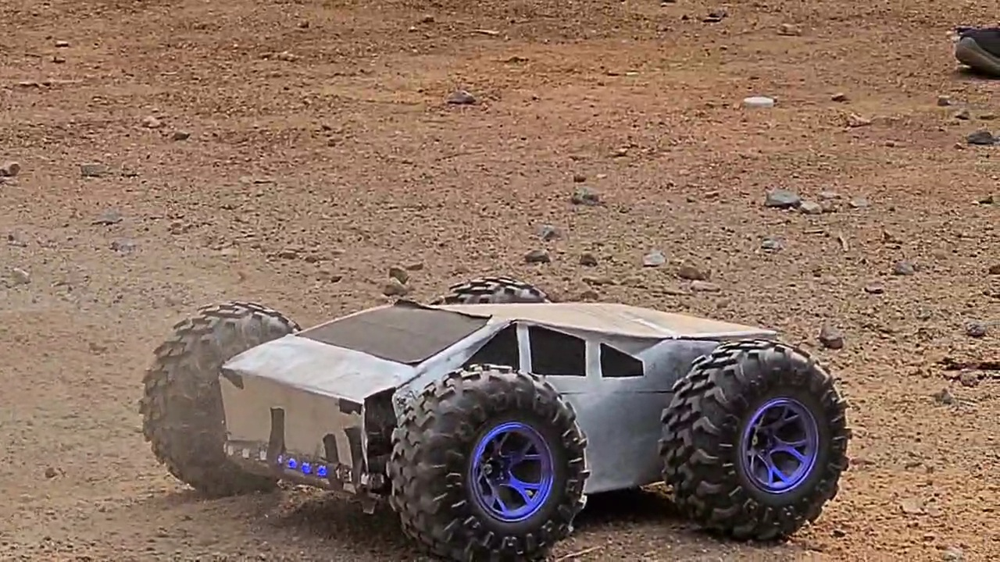
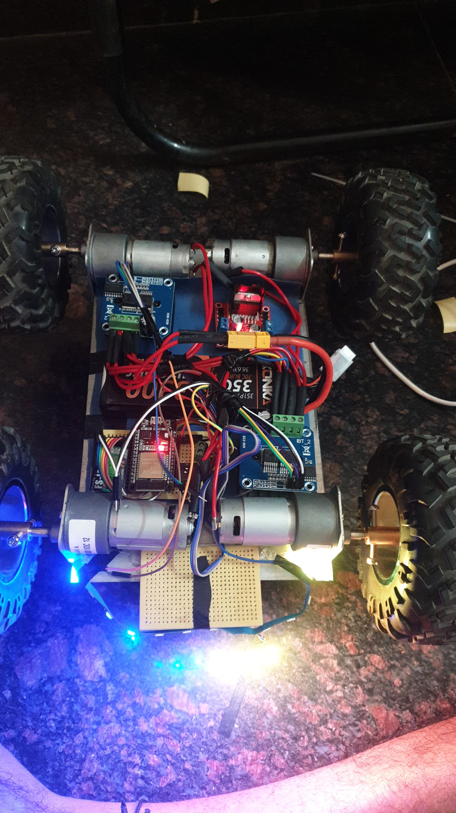

# ESP32 Cyber Truck RC Project

[](https://choosealicense.com/licenses/mit/)
[](https://www.espressif.com/en/products/socs/esp32)
[](https://www.arduino.cc/)


## 📌 Overview

An advanced ESP32-based RC vehicle control system utilizing differential steering for smooth, car-like maneuverability. The project demonstrates expertise in embedded systems programming, PWM motor control, real-time signal processing, and wireless communication.

**Watch our project in action:**
[](./videos/test-ride.mp4)

## 🎮 Key Features

- **Dynamic Differential Steering**: Implements sophisticated algorithm for smooth turning behavior similar to real vehicles
- **RC Signal Processing**: Utilizes interrupt-based timing for precise reading of RC receiver signals
- **Multiple Control Modes**: Supports various driving modes including proportional speed control and spin-in-place capabilities
- **Failsafe Protection**: Automatically stops motors if RC signal is lost to prevent runaway situations
- **LED Feedback System**: Integrated LED strip with multiple visualization modes for status indication
- **High-Current Motor Control**: Interfaces with BTS7960 H-Bridge drivers for controlling high-torque Johnson motors
- **Modular Architecture**: Clean code organization with separated functional components for easy maintenance and extension

## 👥 Team

This project was created by:

| Team Member | Role | Contribution |
|-------------|------|--------------|
| **Kamal Bura** | Hardware Engineer | Primary hardware design and integration |
| **Vighnesh** | Software Developer | Control algorithms and motor driver interface |
| **Karthekeya** | Design Engineer | Chassis design and LED system implementation |

## 🔧 Hardware Components

| Component | Specification | Purpose |
|-----------|---------------|---------|
| Microcontroller | ESP32 Development Board | Main control unit |
| Motor Drivers | BTS7960 H-Bridge (×2) | High-current motor control |
| Motors | Johnson 1000RPM (×4) | Vehicle propulsion |
| RC System | Standard 6-Channel Receiver | Remote control input |
| Power Supply | 7.4V-11.1V LiPo Battery | System power |
| LED System | WS2812B Addressable RGB LEDs | Visual feedback |
| Chassis | Custom Design | Vehicle structure |

## 🔌 Wiring Diagram

### RC Receiver to ESP32
- CH1 (Steering) → ESP32 pin 36
- CH3 (Throttle) → ESP32 pin 34
- CH5 (AUX1) → ESP32 pin 32

### BTS7960 Motor Drivers to ESP32

#### Left Motors Driver
- RPWM (Forward) → ESP32 pin 25
- LPWM (Reverse) → ESP32 pin 26
- VCC → 5V or 3.3V from regulated source
- GND → ESP32 ground

#### Right Motors Driver
- RPWM (Forward) → ESP32 pin 27
- LPWM (Reverse) → ESP32 pin 18
- VCC → 5V or 3.3V from regulated source
- GND → ESP32 ground

### LED Strip
- Data Pin → ESP32 pin 13
- VCC → 5V from regulated source
- GND → ESP32 ground


## 📊 ESP32 System Architecture & Signal Flow

### Core Components Interaction
```
┌─────────────────┐     ┌─────────────────┐     ┌─────────────────────────────┐
│  RC Transmitter  │────▶│  RC Receiver    │────▶│  ESP32 Microcontroller      │
└─────────────────┘     └─────────────────┘     │  - Signal Processing         │
                                               │  - Differential Steering Logic│
                                               │  - PWM Generation             │
                                               │  - Failsafe Monitoring        │
                                               └───────────────┬───────────────┘
                                                               │
                      ┌──────────────────────────────────────┬─┴─┬──────────────────────────────────┐
                      │                                      │   │                                  │
              ┌───────▼──────┐                    ┌──────────▼───▼──────────┐            ┌──────────▼─────────┐
              │ BTS7960      │                    │ BTS7960                 │            │ LED Control System  │
              │ Left Motors  │                    │ Right Motors            │            │ (FastLED)           │
              └───────┬──────┘                    └──────────┬──────────────┘            └──────────┬──────────┘
                      │                                      │                                      │
              ┌───────▼──────┐                    ┌──────────▼──────────────┐            ┌──────────▼──────────┐
              │ Left Motors  │                    │ Right Motors            │            │ WS2812B RGB LEDs    │
              │ (Front/Back) │                    │ (Front/Back)            │            │ (Status/Effects)    │
              └──────────────┘                    └───────────────────────┬─┘            └─────────────────────┘
                                                                         │
┌─────────────────────────────────────────────────────────────────────────┴───────────────────────────────────┐
│                                       Vehicle Movement & Visual Feedback                                     │
└─────────────────────────────────────────────────────────────────────────────────────────────────────────────┘
```

### ESP32 Signal Processing Flow
```
                              ┌───────────────────────────────────────┐
                              │              ESP32                    │
                              │                                       │
┌─────────────────┐           │    ┌───────────────────────────────┐  │
│  RC Receiver     │──CH1─────┼───▶│ Interrupt Handlers            │  │
│  Channels        │──CH3─────┼───▶│ (Precise RC Signal Timing)    │  │
│                  │──CH5─────┼───▶│                               │  │
└─────────────────┘           │    └───────────────┬───────────────┘  │
                              │                    │                  │
                              │    ┌───────────────▼───────────────┐  │
                              │    │ Signal Validation & Mapping   │  │
                              │    │ (Converts RC values to usable │  │
                              │    │  throttle/steering values)    │  │
                              │    └───────────────┬───────────────┘  │
                              │                    │                  │
                              │    ┌───────────────▼───────────────┐  │
                              │    │ Differential Steering Logic   │  │
                              │    │ (Calculates individual motor  │  │
                              │    │  speeds for smooth turning)   │  │
                              │    └─┬─────────────────────────┬───┘  │
                              │      │                         │      │
┌─────────────────┐           │    ┌─▼─────────────┐  ┌────────▼───┐  │    ┌─────────────────┐
│  LED Control    │◀──────────┼────│ LED Pattern   │  │ PWM Signal │  │───▶│ BTS7960 Drivers │
│  (Status/Mode)  │           │    │ Generation    │  │ Generation │  │    │ (Motor Control) │
└─────────────────┘           │    └───────────────┘  └────────────┘  │    └─────────────────┘
                              │                                       │
                              └───────────────────────────────────────┘
```

## 💡 LED Lighting System

The Cyber Truck includes a sophisticated LED feedback system that provides visual status indication and aesthetic effects.

### LED Hardware Configuration
- **LED Type**: WS2812B Addressable RGB LEDs
- **Control Pin**: GPIO 13
- **Number of LEDs**: 12
- **Power**: 5V, driven directly from ESP32

### LED Functionality Matrix

| Mode | Description | Operational Pattern | Selection |
|------|-------------|---------------------|-----------|
| 0 | All Off | All LEDs disabled | AUX1 low range |
| 1 | Speed Indicator | Color gradient based on motor speed | AUX1 low-mid range |
| 2 | Rainbow Pattern | Continuous color cycling animation | AUX1 mid range |
| 3 | Direction Indicators | Blue (forward), Red (reverse), Yellow (turning) | AUX1 mid-high range |
| 4 | Chase Effect | Single LED chase around perimeter | AUX1 high range |
| Failsafe | Warning Indicator | Rapid red flashing when signal lost | Automatic |

## 🧠 ESP32 Control Architecture

### Core ESP32 Functionality
- **RC Signal Reading**: Hardware interrupt-based pulse timing (1-2ms PPM signals)
- **Motor Control**: 4-channel PWM generation for BTS7960 H-Bridge drivers
- **Differential Steering**: Dynamic speed calculation based on throttle and steering inputs
- **LED Animation**: Fast parallel processing of lighting effects
- **Failsafe Monitoring**: Continuous validation of input signals with timeout detection

### ESP32 Pin Assignment

| Function | GPIO Pin | Description |
|----------|----------|-------------|
| RC Channel 1 (Steering) | 36 | Steering input from RC receiver |
| RC Channel 3 (Throttle) | 34 | Throttle input from RC receiver |
| RC Channel 5 (AUX1) | 32 | Mode selection input |
| Left Motors Forward | 25 | PWM control to BTS7960 |
| Left Motors Reverse | 26 | PWM control to BTS7960 |
| Right Motors Forward | 27 | PWM control to BTS7960 |
| Right Motors Reverse | 18 | PWM control to BTS7960 |
| LED Data | 13 | Addressable LED control |

### ESP32 Processing Workflow

1. **Signal Acquisition**
   - Capture RC signal pulses via interrupts
   - Convert pulse timing to normalized values (-255 to 255)

2. **Control Logic Processing**
   - Apply deadzone filtering to remove jitter
   - Calculate differential steering values
   - Determine appropriate LED patterns

3. **Output Generation**
   - Generate PWM signals for motor control
   - Update LED strip with current pattern
   - Send debug data via Serial (if active)

4. **Safety Monitoring**
   - Check for signal timeout conditions
   - Implement smooth transitions between states
   - Prevent motor driver conflicts

## 🚀 Getting Started

### Prerequisites
- Arduino IDE (1.8.13 or later)
- ESP32 board package installed in Arduino IDE
- Required libraries:
  - FastLED
  - Arduino.h

### Installation

1. Clone this repository:
```bash
git clone https://github.com/Kamalbura/cyber-truck.git
```

2. Open the Arduino IDE and load the `esp32_rc_car.ino` file

3. Select the appropriate ESP32 board from Tools > Board menu

4. Connect your ESP32 board via USB

5. Compile and upload the sketch

## 📝 Usage Instructions

1. Connect hardware according to the wiring diagram
2. Power on the RC transmitter
3. Power on the vehicle
4. Use the transmitter controls:
   - Left stick: Forward/Reverse throttle
   - Right stick: Left/Right steering
   - AUX1 switch: LED mode selection

## 🔬 Technical Achievements

- **Real-time Signal Processing**: Implemented high-precision interrupt-based RC signal reading
- **Advanced Control Algorithms**: Developed proportional differential steering with smooth transitions
- **Efficient Memory Usage**: Optimized code for ESP32's limited memory environment
- **Failsafe Implementation**: Created robust error detection and handling mechanisms
- **Smooth Direction Changes**: Implemented protection against sudden direction reversals

## 🎥 Project Demo

Check out our comprehensive demo video showcasing all features of the ESP32 Cyber Truck:

[](./videos/demo.mp4)

The demo includes:
- Different steering modes
- LED lighting system demonstrations
- Performance on various terrains
- Failsafe feature in action

## 🔮 Future Enhancements

- [ ] Add MPU6050 for gyroscopic stabilization
- [ ] Implement Bluetooth control option via smartphone app
- [ ] Add telemetry data transmission
- [ ] Develop autonomous navigation capabilities
- [ ] Create web interface for configuration settings

## 📜 License

This project is licensed under the MIT License - see the LICENSE file for details.

## 👨‍💻 Authors

Project by Kamal Bura, Vighnesh, and Karthekeya

## 🙏 Acknowledgments

- ESP32 Community for their excellent documentation
- FastLED library developers
- Arduino community for library support
- Our instructors and classmates for valuable feedback

---

*Created as part of an embedded systems engineering project, this repository demonstrates practical application of microcontroller programming, PWM motor control, and real-time systems design.*


